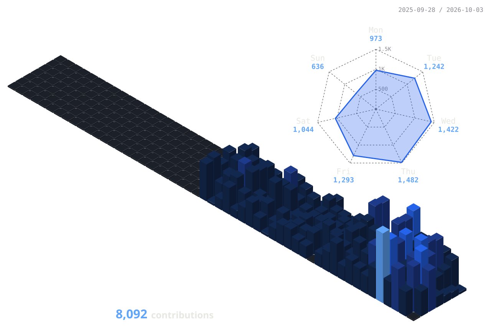

<!-- wth-lg's profile README. The palette is wentao.gg's: ink #0b0d12, paper #e8e8e2, blue #2563eb.
     The 3D calendar (profile-3d-contrib/) and the snake (the output branch) are redrawn by this repo's workflows. -->

  

  

  
  
  
  

---

### 👋 hi, i'm wentao

- 🛠️ **Engineering Lead at [Mercor](https://www.mercor.com/)** in San Francisco, building data infrastructure
- 🧭 before that: data engineer at **Meta**, software engineer at **Cherre** and **Mashey**, ML engineer at **Jefferson Street Technologies**
- 🎓 MS Robotics (Artificial Intelligence) at **Penn** · MS Mechanical Engineering at **Carnegie Mellon**
- 🏋️ off the keyboard: powerlifting and photography
- 🌐 everything else lives at **[wentao.gg](https://wentao.gg)**

### 🧪 side projects

| | |
|:--|:--|
| 🐋 **[Whale Tracker](https://wentao.gg/projects/hl-whale-tracker)** Hyperliquid's top 50 perp accounts by PnL, ROI and volume, with their live positions and fills | 🏋️ **[PowerOPPS](https://wentao.gg/projects/poweropps)** powerlifting scores across 5 systems (IPF GL, DOTS, Wilks 2.0, IPF, Old Wilks), with reverse calculation for targets |
| 📊 **[ProgDash](https://wentao.gg/projects/progdash)** a Google Sheets training log, parsed into blocks, sets and progression | 🎥 **What's my RPE?** · coming soon barbell speed from video (pose estimation, optical flow) to predict RPE and estimate a 1RM |

### 🧰 stack

  

### 📈 activity

  <picture>
    <source media="(prefers-color-scheme: dark)" srcset="./profile-3d-contrib/profile-night-view.svg" />
    <source media="(prefers-color-scheme: light)" srcset="./profile-3d-contrib/profile-green.svg" />
    
  </picture>

  <picture>
    <source media="(prefers-color-scheme: dark)" srcset="https://streak-stats.demolab.com?user=wth-lg&hide_border=true&background=0B0D12&stroke=13213F&ring=2563EB&fire=60A5FA&currStreakNum=E8E8E2&sideNums=E8E8E2&currStreakLabel=60A5FA&sideLabels=8B8B94&dates=8B8B94" />
    
  </picture>

  

  <picture>
    <source media="(prefers-color-scheme: dark)" srcset="https://raw.githubusercontent.com/wth-lg/wth-lg/output/github-snake-dark.svg" />
    <source media="(prefers-color-scheme: light)" srcset="https://raw.githubusercontent.com/wth-lg/wth-lg/output/github-snake.svg" />
    
  </picture>

  

