<!-- wth-lg's profile README. assets/build.py draws the images in assets/ (scripts/daily.py draws stats.svg and restyles
     the 3D calendar every day, .github/workflows/profile-3d.yml; the snake is .github/workflows/snake.yml). The design is
     wentao.gg's: Space Grotesk and JetBrains Mono, ink, paper and one blue, a 100 ms beat; build.py's docstring has it. -->

  &nbsp;
  &nbsp;
  

<picture>
  <source media="(prefers-color-scheme: dark)" srcset="https://raw.githubusercontent.com/wth-lg/wth-lg/main/profile-3d-contrib/profile-night-view.svg" />
  <source media="(prefers-color-scheme: light)" srcset="https://raw.githubusercontent.com/wth-lg/wth-lg/main/profile-3d-contrib/profile-green.svg" />
  
</picture>
<picture>
  <source media="(prefers-color-scheme: dark)" srcset="https://raw.githubusercontent.com/wth-lg/wth-lg/output/github-snake-dark.svg" />
  <source media="(prefers-color-scheme: light)" srcset="https://raw.githubusercontent.com/wth-lg/wth-lg/output/github-snake.svg" />
  
</picture>

